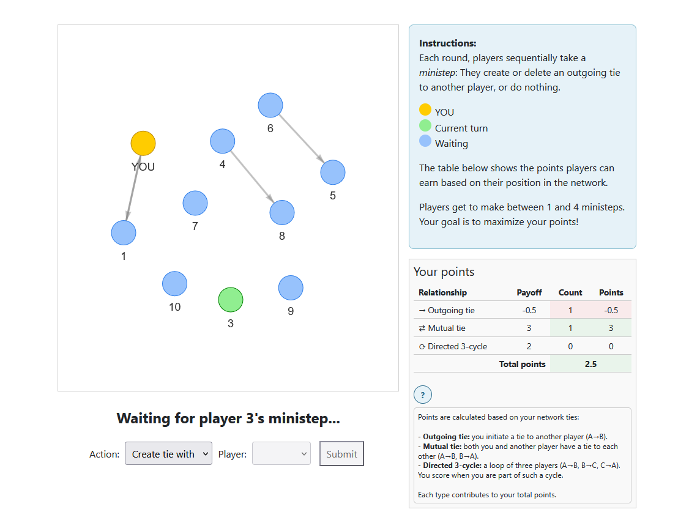

# A social networking game in oTree



## How to use

### 1. Set destination folder
```{cmd}
cd C:\Users\YourName\Projects
```
### 2. Clone repository
```{cmd}
git clone https://github.com/robfranken/twostep_otree.git
cd twostep_otree
```

### 3. Install dependencies
```{cmd}
pip install -r requirements.txt
```
### 4. Run oTree devserver
```{cmd}
otree devserver
```

### 5. Open in browser
```{arduino}
http://localhost:8000
```
